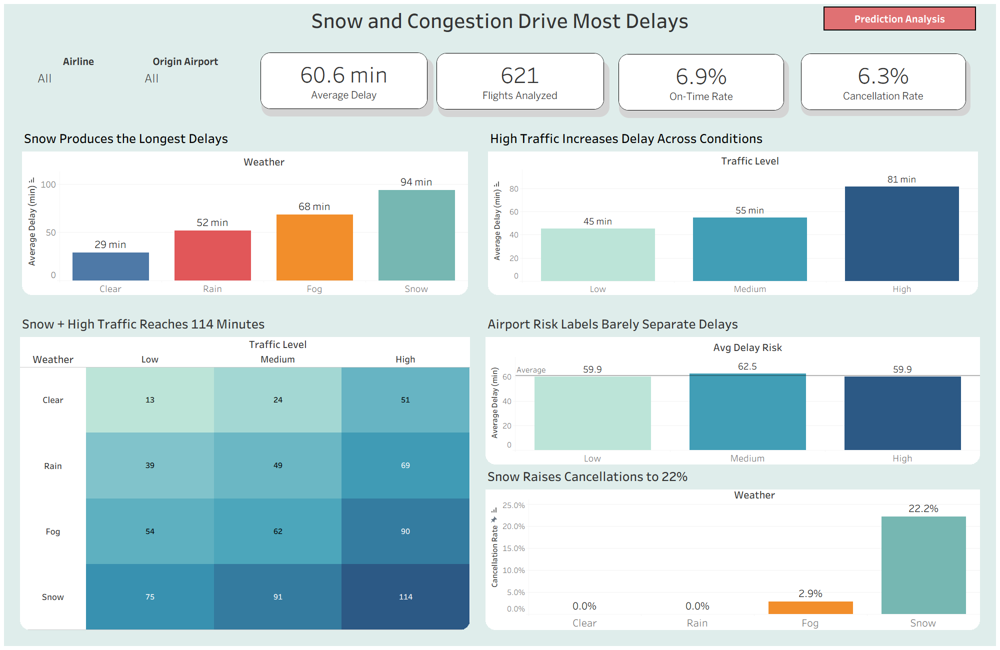
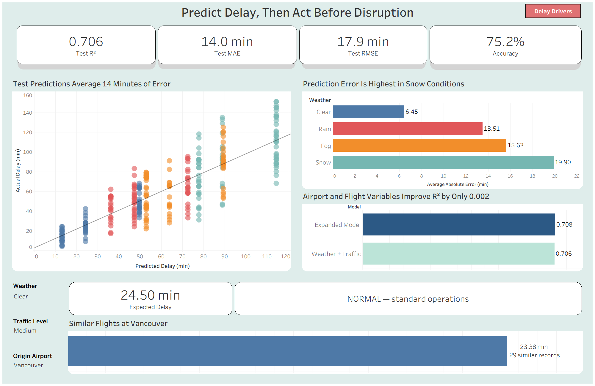

# Airline Delay Analytics and Operational Decision Support

## Project Overview

This project analyzes historical airline operations to identify the factors that most strongly influence flight delays and to support proactive operational decision-making.

The project combines Python-based predictive modeling with interactive Tableau dashboards. The analysis progresses from identifying delay drivers to predicting expected delays and recommending operational actions under different weather, traffic, and airport conditions.

## Business Problem

Airline delays create operational costs, missed connections, scheduling disruptions, and poor passenger experiences.

Airlines need to understand which operating conditions contribute most strongly to delays and determine what actions should be taken before those conditions cause major disruption.

This project addresses two central questions:

1. Which weather and traffic conditions generate the highest delay risk?
2. How can historical data and predictive modeling support proactive operational decisions?

## Tools and Technologies

* Tableau Desktop
* Python
* Pandas
* NumPy
* Scikit-learn
* Jupyter Notebook
* Excel
* Predictive modeling
* Interactive dashboard design

## Data Preparation

The original dataset included three related tables:

* Flights
* Flight Details
* Airports

Logical relationships were used in Tableau to preserve the different levels of detail and prevent flight-level measures from being duplicated.

Python was used to process the operational-detail records, create predictions, calculate model errors, classify delay categories, and export analysis-ready files for Tableau.

The analysis included:

* 700 total flights
* 621 flights with operational-detail records
* 1,500 operational-detail records
* 1,471 records with valid delay values
* Four origin airports: Calgary, Montreal, Toronto, and Vancouver

## Predictive Approach

Two regression models were evaluated.

### Model 1: Weather and Traffic

The first model predicted delay minutes using:

* Weather
* Traffic level

### Model 2: Expanded Airport and Flight Model

The second model added:

* Airport delay-risk level
* Airport capacity
* Airline
* Flight distance
* Scheduled departure hour

The expanded model improved R² by only approximately 0.002. The simpler Weather and Traffic model was therefore selected because it provided almost identical performance with fewer variables and greater interpretability.

## Model Performance

The selected model achieved:

* Test R²: 0.7064
* Mean Absolute Error: 14.03 minutes
* Root Mean Squared Error: 17.95 minutes
* Delay-category accuracy: 75.24%

## Dashboard 1: Airline Delay Drivers

The first dashboard presents the operational context and identifies the main factors associated with airline delays.

It includes:

* Total flights analyzed
* Average delay
* On-time rate
* Cancellation rate
* Delay by weather
* Delay by traffic level
* Weather × Traffic risk matrix
* Airport-risk comparison
* Cancellation rates by weather
* Airline and airport filters



## Dashboard 2: Prediction and Operational Action

The second dashboard moves from descriptive analysis to predictive and prescriptive decision support.

It includes:

* Model performance metrics
* Predicted versus actual delays
* Prediction error by weather
* Model comparison
* Weather and traffic scenario selection
* Expected delay
* Recommended operational response
* Comparable historical airport performance



## Key Findings

* Weather was the strongest operational delay driver.
* Average delay increased from approximately 29 minutes in clear weather to approximately 94 minutes during snow.
* High-traffic conditions produced approximately 81 minutes of average delay, compared with approximately 45 minutes under low traffic.
* Snow combined with high traffic produced the highest-risk scenario, with approximately 114 minutes of expected delay.
* The model explained approximately 71% of the variation in held-out delay records.
* Prediction error was highest during snow, indicating that winter-weather forecasts should be interpreted with an additional operational safety buffer.
* Adding airport and flight variables produced almost no improvement over the simpler Weather and Traffic model.

## Operational Recommendations

Based on the analysis, airlines should:

1. Strengthen snow-readiness and de-icing procedures.
2. Add turnaround and scheduling buffers during high-traffic periods.
3. Use weather and traffic predictions together rather than evaluating them independently.
4. Protect or proactively rebook passenger connections during severe scenarios.
5. Use airport-level historical evidence as supporting context when allocating operational resources.

## Repository Structure

```text
airline-delay-analytics-tableau/
├── README.md
├── tableau/
│   └── airline_delay_analytics.twbx
├── notebooks/
│   └── airline_delay_modeling.ipynb
├── report/
│   └── airline_delay_analytics_report.pdf
├── images/
│   ├── airline_delay_drivers_dashboard.png
│   └── airline_prediction_action_dashboard.png
└── data/
    └── README.md
```

## Project Files

* [Tableau Workbook](tableau/airline_delay_analytics.twbx)
* [Python Modeling Notebook](notebooks/airline_delay_modeling.ipynb)
* [Final Report](report/airline_delay_analytics_report.pdf)

## Project Contribution

This was a collaborative academic project. My contribution included participating in the analytical workflow, dashboard development, validation of results, interpretation of findings, and preparation of the final recommendations.

## Author

**Luis Enrique Villalobos Socualaya**
Master of Data Analytics Student
[LinkedIn](https://www.linkedin.com/in/luisvillaloboss/)
